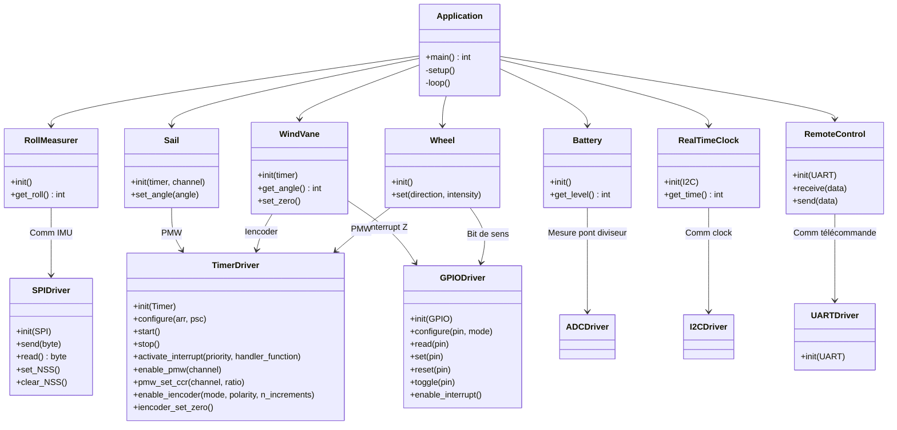

# voilier

## Class diagram

Note: can be edited and viewed in vscode with markdown preview mermaid support extension, or directly in github.

```mermaid

classDiagram
    Application --> RollMeasurer
    Application --> Sail
    Application --> WindVane
    Application --> Wheel
    Application --> Battery
    Application --> RealTimeClock
    Application --> RemoteControl
    Sail --> TimerDriver: PMW
    WindVane --> TimerDriver: Iencoder
    WindVane --> GPIODriver: Interrupt Z
    RollMeasurer --> SPIDriver: Comm IMU
    Wheel --> TimerDriver: PMW
    Wheel --> GPIODriver: Bit de sens
    Battery --> ADCDriver: Mesure pont diviseur
    RealTimeClock --> I2CDriver: Comm clock
    RemoteControl --> UARTDriver: Comm télécommande

    class Application{
        +main() int
        -setup()
        -loop()
    }

    class RollMeasurer{
        +init()
        +get_roll() int
    }

    class Sail{
        +init(timer, channel)
        +set_angle(angle)
    }

    class WindVane{
        +init(timer)
        +get_angle() int
        +set_zero()
    }

    class Wheel{
        +init()
        +set(direction, intensity)
    }

    class Battery{
        +init()
        +get_level() int
    }

    class RealTimeClock{
        +init(I2C)
        +get_time() int
    }

    class RemoteControl{
        +init(UART)
        +receive(data)
        +send(data)
    }

    class SPIDriver{
        +init(SPI)
        +send(byte)
        +read() byte
        +set_NSS()
        +clear_NSS()
    }

    class TimerDriver{
        +init(Timer)
        +configure(arr, psc)
        +start()
        +stop()
        +activate_interrupt(priority, handler_function)
        +enable_pmw(channel)
        +pmw_set_ccr(channel, ratio)
        +enable_iencoder(mode, polarity, n_increments)
        +iencoder_set_zero()
    }

    class GPIODriver{
        +init(GPIO)
        +configure(pin, mode)
        +read(pin)
        +set(pin)
        +reset(pin)
        +toggle(pin)
        +enable_interrupt()
    }

    class UARTDriver{
        +init(UART)
    }

    class ADCDriver{

    }

``` 
